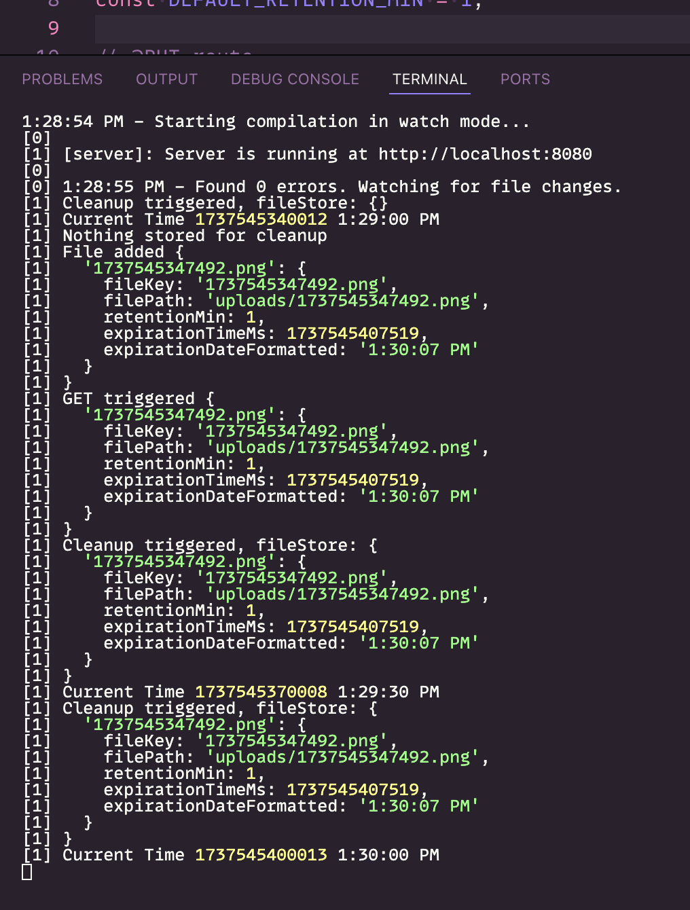

## Server for Ephemeral File Sharing

> There is client repo for this project

Stack:

1. Node + TS
2. Express (cors + middleware)
3. Node-schedule
4. Jest

```
# Install
yarn install

# Run
yarn dev
```


